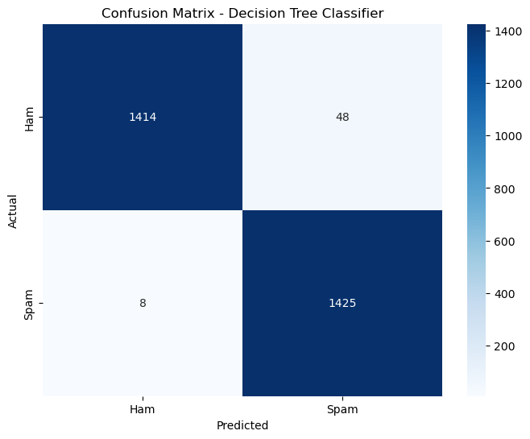
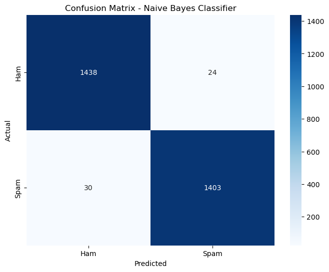

# email_spam_classifier
Email Spam Classifier
This project is a simple email spam classifier that uses a Naive Bayes model and a TF-IDF vectorizer to classify emails as Spam or Ham (Not Spam). The classifier can be used through a web application built with Streamlit.

Features
Classify emails as Spam or Ham.
Upload and classify multiple emails from a CSV file.
Download predictions as a CSV file.
Getting Started
To get started with this project, follow the steps below:

Prerequisites
Conda or virtualenv for creating a virtual environment
Clone the Repository
First, clone this repository to your local machine:

bash
Copy code
git clone https://github.com/your-username/email_spam_classifier.git
cd email_spam_classifier
Create a New Environment
Create a new virtual environment and activate it:

bash
Copy code
# Using Conda
conda create -n spam_classifier_env 
conda activate spam_classifier_env

# Or using virtualenv
virtualenv spam_classifier_env
source spam_classifier_env/bin/activate  # On Windows use `spam_classifier_env\Scripts\activate`
Install Dependencies
Install the required libraries using the requirements.txt file:

bash
Copy code
pip install -r requirements.txt
Adjust Paths
Make sure to adjust the paths in the code for loading the model and vectorizer, as needed. Update the following lines in your code:

python
Copy code
model = joblib.load('path_to_your_model/naive_bayes_model.pkl')
vectorizer = joblib.load('path_to_your_vectorizer/tfidf_vectorizer.pkl')
Run the Application
Finally, run the Streamlit application:

bash
Copy code
streamlit run main.py

Usage
Enter the email message in the text area to classify it.

the confusion matrix of two trained model in which i select naive model

 
naive model

